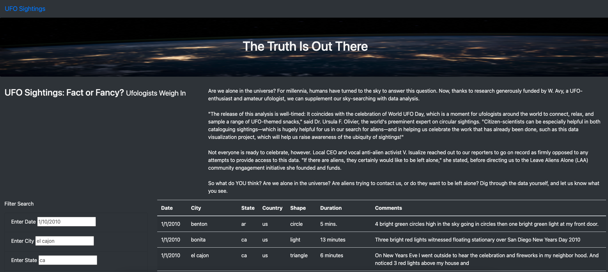
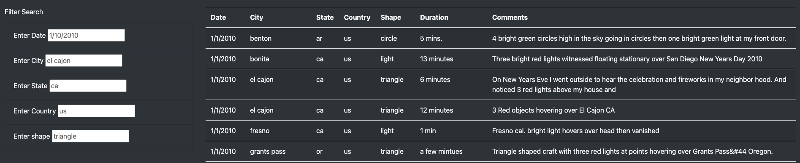
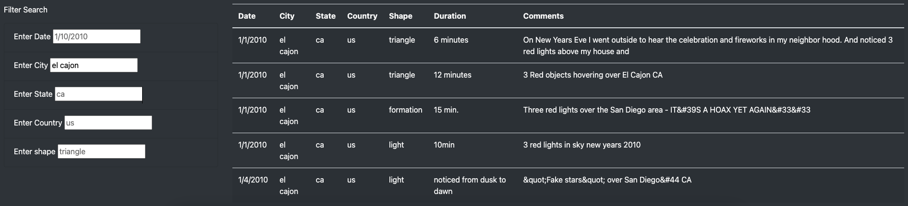
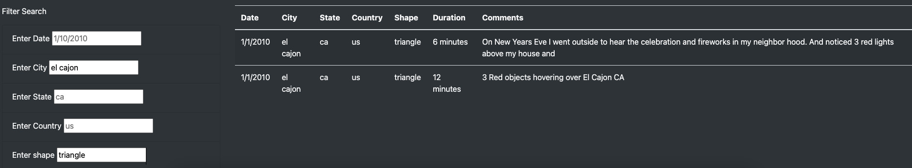
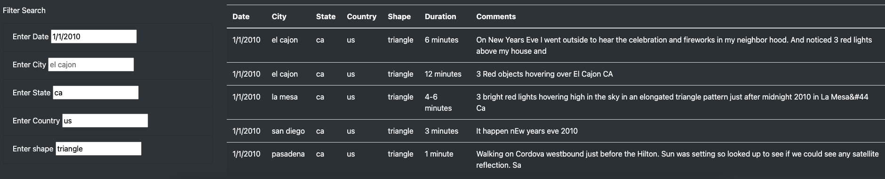

# UFO Sightings
The Truth Is Out There!!! UFO Sightings: Fact or Fancy?

We might not know what lies beyond our world, but we can sure track sightings to UFOs. This project intends to do just that!

## Overview
This project tracks and displays UFO sightings recorded World Wide. The UFO sighting information is stored in a JavaScript array or List which is converted to an HTML table which can be viewed on any web browser. 

The website will provide its user the ability to filter data based on certain key criteria's. They table data will be dynamically refreshed based on the filter criteria and the webpage will be immediately updated to reflect the results based on the search/filter criteria. 

### Resources
- [Data Source](static/js/data.js)
- Development stack: HTML/CSS, JavaScript, Bootstrap.
- Tools required: Visual Code (recommended)

## Results
Results of the project are described with the help of a running website and screenshots depicting the usage of the website. 

### Link to UFO Sightings webpage
The Website is hosted at - https://skhidrapure.github.io/UFOs/

### Landing Page
Below is the screenshot of the landing page. The website is divided into 4 horizontal sections.
1. Navigation bar
2. A jumbotron title bar
3. A fluid container for the Overview of the project.
4. A fluid container with two main elements 
    1. Various search/filter criteria.
    2. Table displaying the sighting information.

### Table overview
The below snapshot shows the table its field/columns and search criteria's. 
The table provides 5 filtering criteria.
1. Date when the sighting occurred.
2. City where the sighting occurred.
3. State where the sighting occurred.
4. Country where the sighting occurred. 
5. Shape of the sighting.

### Filtering by single criteria
The below snapshot shows how a user can apply a single filter. Type the required search criteria in the relevant box and press enter to apply the filter. 

### Filtering by multiple criteria - 2 filters
The below snapshot shows how a user can apply multiple filters. Type the required search criteria in the relevant box and press enter, repeat to add more criteria. 

### Filtering by multiple criteria - 4 filters
The below snapshot shows how a user can apply multiple filter & remove existing ones. Type the required search criteria in the relevant box and press enter, repeat to add more criteria's. To remove a filter, clear the box and press enter. 

### Summary
- The project provides a clean and efficient way to display and filter the UFO sighting data. The code can dynamically filter and refresh the sighting data. 
- The project can be improved by enhancing the filter functionality
    - We can prepopulate the filters with search text so user doesn't have to lookup data to find the filter criteria's. 
    - A Quick and efficient way to clear all existing filters. 
    - The Project right not only displays from an static js file, We can enhance the project to scrape data from multiple sources and build our own database of sightings. 
